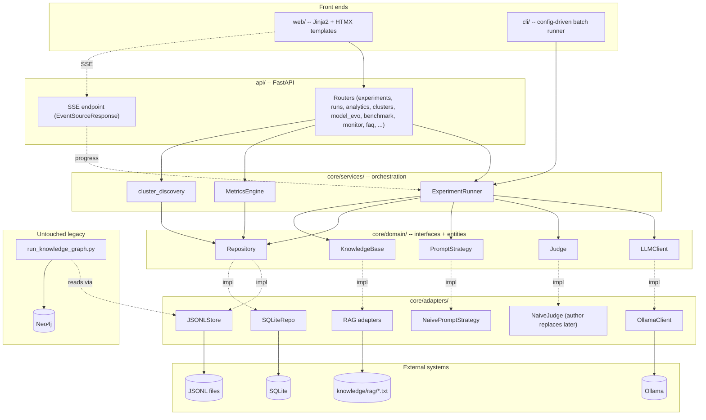

# LLM data lab / Psycho-Data-Augmentor

## Intro

`nn_lab` (Psycho-Data-Augmentor) is a portfolio project built to demonstrate one specific skill:
testing large language models rigorously, not just using them. It generates synthetic text by
conditioning local LLMs (via [Ollama](https://ollama.com), no paid API) on behavioral archetypes,
then runs a validation and linguistic/statistical analysis pipeline over the resulting corpus to
check whether the generated text actually reflects the archetype it was asked to produce — and
whether the metrics used to measure that are themselves trustworthy, not just noise dressed up as
signal.

It started as a single ~3,400-line Streamlit script and was rebuilt, stage by stage (Stages 0-15,
see [Migration Roadmap](#migration-roadmap)), into a layered FastAPI application. As of Stage 16,
that rewrite is the primary way to run the app — the original script now lives at
[`legacy/streamlit_app.py`](legacy/streamlit_app.py), kept for reference, superseded everywhere
except `tab_knowledge_graph` (Neo4j), which was extracted into its own small standalone script,
[`run_knowledge_graph.py`](run_knowledge_graph.py) (see [Services](#services) below). The rebuild
itself is part of what's being demonstrated — staged, tested, documented software engineering, not
a one-shot script.

It is not a product and isn't meant to scale past one user on one machine — every architectural
decision optimizes for correctness and testability over breadth of features or deployment
sophistication.

**Quick summary**
- App purpose: run AI/NLP models in different modes (Teacher–Student, Self‑Critic, Blind Mode) and collect structured results.
- Parameters: supports sweeps of temperature, top‑p, penalties, max tokens.
- RAG integration: retrieves knowledge chunks to enrich prompts.
- Analysis: calculates sentiment, subjectivity, lexical density, repetition, POS distribution, plus neuro‑metrics like rigidity, cognitive load, coherence, self‑focus.
- Visualization: PCA, HDBSCAN, UMAP clustering to compare model behavior and detect anomalies.
- Outcome: helps evaluate how models differ, what patterns they produce, and how parameters influence style and quality.

---

## Core app

What the pipeline actually does, end to end: generate → transform → extract features → persist →
visualize.

### Core Pipeline

1. Generate synthetic text via a local LLM (Ollama)
2. Apply a behavioral-archetype conditioning prompt
3. Extract linguistic features using NLTK + TextBlob
4. Store the structured dataset (JSONL)
5. Visualize results (FastAPI + Plotly, or the legacy Streamlit KG explorer for Neo4j)

### Experimental model (archetypes)

- Common → strict formatting, structural wrapper, zero filtering.
- Neutral → normal personality = control group.
- Expressive → emotional, expressive, theatrical.
- Defensive → rigid, controlled, repetitive.
- Detached → abstract, cognitive, low affect.

### NLP feature set

- sentiment (VADER) → `Sentiment = (Positive − Negative) / Total`
- subjectivity (TextBlob) → `Subjectivity = Subjective Words / Total Words`
- lexical diversity (corrected TTR)
- readability (ARI)
- POS distribution
- self-focus ratio → `SelfFocus = Self Pronouns / Total Pronouns`
- modality strength
- cognitive density
- repetition score → `Repetition = Repeated Tokens / Total Tokens`
- sentiment variance
- abstractness ratio (WordNet heuristic)

### Neuro-metrics

- rigidity → `Rigidity = (Imperatives + Repetitions) / Total Sentences`
- cognitive load → `Cognitive Load = Complex Words / Total Words`
- coherence (semantic similarity between sentences)
- anomaly detection (cluster outliers)

The full 66-key response-record schema (every field a persisted response actually carries) is
documented in the Sphinx docs' [Features page](docs/source/features.rst) under "Response record
fields."

### Hyperparameters

| Parameter | Effect |
| --- | --- |
| Temperature | creativity vs determinism |
| Top-p | token filtering |
| Frequency penalty | repetition control |
| Presence penalty | topic diversity |
| Max tokens | output length control |

Recommended starting values: Temperature `0.3–1.2`, Top-p `0.9`, Frequency penalty `1.1–1.2`, Max
tokens `800`, seed `42` (for reproducibility).

### UMAP → HDBSCAN pipeline flow (Stage 10, `/clusters`)

```text
High-dimensional features
        │
        ▼
  StandardScaler
        │
        ▼
  UMAP projection
        │
        ▼
HDBSCAN density graph
        │
        ▼
Mutual reachability graph → Minimum spanning tree
```

---

## Services

How to install, configure, and run every part of this app.

### Installation & Setup

**1. Pre-install core management tools (one-time)**

Ubuntu:
```bash
sudo apt update && sudo apt install pipx python3-venv -y
pipx install tox
pipx install pip-tools
```

Windows 11 (Command Prompt or PowerShell, do **not** activate a local project `.venv`):
```cmd
python -m pip install --user tox pip-tools
```

**2. Create the local virtual environment**

Ubuntu:
```bash
python3.12 -m venv .venv
source .venv/bin/activate
```

Windows 11 (Python 3.12 — required for the current PyTorch/CUDA stack):
```cmd
py -3.12 -m venv .venv
.venv\Scripts\activate
```

*Always verify `.venv/` and `.tox/` are excluded via `.gitignore`.*

**3. Install dependencies**

Ubuntu:
```bash
pip install --upgrade pip
pip install -r requirements-base.txt -r requirements-linux.txt
```

> **⚠️ Known gap, confirmed 2026-08-24, not yet fixed:** `requirements-linux.txt` was last regenerated
> 2026-06-22 — before the FastAPI rewrite (`fastapi`, `sqlalchemy`, and ~30 other packages added since
> are simply absent from it). This command may fail to resolve, or silently install a stale/mismatched
> set, on a fresh Ubuntu machine today. It has not been re-verified on real Linux since the rewrite
> began. Fix: run `pip-compile requirements.in --output-file=requirements-linux.txt` on an actual
> Ubuntu box (required — `pip-compile` resolves against the *running* platform's wheels, this can't be
> done from Windows), then re-verify `uvicorn api.app:app` and `pytest tests --ignore=tests/e2e` both
> work there. See `docs/source/wiki/02-tools-and-stack.rst`'s disclosed-gaps section.

Windows 11 (needs the CUDA-specific PyTorch index first):
```cmd
python -m pip install --upgrade pip
pip install torch torchvision --index-url https://download.pytorch.org/whl/cu121 --no-cache-dir
pip install -r requirements-base.txt
```

**4. Populate NLTK corpora** (required by `PsychScientist`/`NeuroMetrics`):
```bash
python -c "import nltk; nltk.download('vader_lexicon'); nltk.download('punkt'); nltk.download('punkt_tab'); nltk.download('brown'); nltk.download('averaged_perceptron_tagger_eng')"
```

**5. Download the spaCy model** (required by `core/analysis/syntactic_complexity.py`'s
`dependency_distance` metric -- the small English model, matching this project's "weak machine"
CPU-friendly stance, the same reasoning behind picking `all-MiniLM-L6-v2` for embeddings):
```bash
python -m spacy download en_core_web_sm
```

**6. Create `config/config.ini`** (required -- not just for Neo4j):
```bash
# Windows
copy config\config.ini.example config\config.ini
# Linux
cp config/config.ini.example config/config.ini
```
`config/config.ini` is gitignored (it can hold a real Neo4j password) and
`utils/config_loader_short.py` raises `FileNotFoundError` at **import time** if it's missing --
nearly the whole app (`uvicorn`, the CLI, `pytest`) fails to even start without it, not just the
Neo4j knowledge-graph explorer. The example file's `[OLLAMA]`/`[DIRECTORIES]`/`[FILES]`/
`[EXPERIMENT]` sections work as-is; only `[neo4j]`'s placeholder password needs a real value, and
only if you plan to run `run_knowledge_graph.py` (see **Neo4j setup** below).

### Dependency Architecture

To prevent heavy CUDA/Triton/NCCL dependency conflicts between Windows and Linux, this project
splits compilation via `pip-tools`:

- `requirements.in` — single source-of-truth for top-level dependencies.
- `requirements-base.txt` — compiled cross-platform packages (FastAPI, pandas, scikit-learn, Ollama, etc.).
- `requirements-linux.txt` — compiled Ubuntu-only packages (`triton`, `nvidia-nccl-cu13`, `nvidia-nvshmem-cu13`).
- `requirements-windows.txt` — reserved for Windows-specific constraints (stays empty; Windows installs PyTorch via a custom index URL instead).

Regenerating a lock file — never hand-edit the generated `requirements-*.txt` files:
```bash
pip-compile requirements.in --output-file=requirements-base.txt
pip-compile requirements.in --output-file=requirements-linux.txt   # must run on Ubuntu
```

### Running the app

Three separate front ends exist. Only the third is a different codebase (the pre-rewrite legacy
script); the first two share one `ExperimentRunner`.

**1. FastAPI web app** — start with:
```bash
uvicorn api.app:app --reload
```
then open http://127.0.0.1:8000/. See [UI layers](#ui-layers) below for every page.

**2. CLI batch runner** (Stage 15) — no browser needed:
```bash
python -m cli.run_experiment --config cli/example_config.toml
```
Reuses the same `ExperimentRunner` and real adapters (`OllamaClient`, `JSONLStore`,
`NaivePromptStrategy`, `NaiveJudge`) as `/experiments` — a config-driven TOML file in, progress
printed to stdout, an identical-shaped JSONL out. See `cli/example_config.toml` for the full field
reference (mirrors `ExperimentConfig` exactly).

**3. Legacy Neo4j knowledge-graph explorer** (Stage 16) — the *only* remaining reason to run
Streamlit at all:
```bash
streamlit run run_knowledge_graph.py
```
Opens at http://localhost:8501 by default. Loads a run's persisted responses via the same
`JSONLStore` the FastAPI app and CLI both use (so any run generated through either front end is
reachable here), then renders `tab_knowledge_graph`'s Neo4j sync/PageRank/visualization exactly as
it worked before the rewrite. `legacy/streamlit_app.py` (the full original script) still exists on
disk and is still technically runnable (`streamlit run legacy/streamlit_app.py`), but every tab it
has besides `tab_knowledge_graph` now has a tested FastAPI/CLI equivalent — treat it as historical
reference, not a live entry point.

#### UI layers

**FastAPI (Jinja2 + HTMX)**:

| Page | URL | What |
|---|---|---|
| Landing page | http://127.0.0.1:8000/ | Links to every page below |
| Run an experiment | http://127.0.0.1:8000/experiments | Full `tab_gen` parity — judge, sweep, RAG, self-critic |
| Run summaries | http://127.0.0.1:8000/runs | `tab_perf` — record counts, timing, model/archetype/bias breakdown |
| Analytics | http://127.0.0.1:8000/analytics | `tab_analytics` — adherence, high-dim, Zipf-deviation, real-tokens/sec charts |
| ↳ Adherence & metrics | http://127.0.0.1:8000/analytics#adherence | Heatmap, workload, latency, velocity, diversity, distance, real tokens/sec |
| ↳ High-Dim analytics | http://127.0.0.1:8000/analytics#high-dim | Logic-pipeline, productivity, teacher-impact/cross-model matrices |
| ↳ Zipf deviation | http://127.0.0.1:8000/analytics#zipf | Distribution + by-archetype charts |
| Deep NLP investigation | http://127.0.0.1:8000/nlp | `tab_nlp` — POS morphology, cognitive/emotional, neuropsychological charts |
| ↳ NLP-1 | http://127.0.0.1:8000/nlp#nlp-1 | POS morphology, cognitive complexity, emotional engagement |
| ↳ NLP-2 | http://127.0.0.1:8000/nlp#nlp-2 | Emotional stability, repetition/fixation |
| ↳ NLP-3 | http://127.0.0.1:8000/nlp#nlp-3 | Sentence structure, neuropsychological metrics, coherence |
| Multi-dimensional analysis | http://127.0.0.1:8000/clusters | `tab_clusters` — K-Means, HDBSCAN, Behavioral topology |
| ↳ K-Means (PCA) | http://127.0.0.1:8000/clusters#kmeans-pca | PCA scatter, PC1/PC2 axis drivers, cluster-purity table |
| ↳ HDBSCAN (Density) | http://127.0.0.1:8000/clusters#hdbscan-density | Density-based clustering on full-dimensional scaled features |
| ↳ Behavioral topology | http://127.0.0.1:8000/clusters#behavioral-topology | UMAP+HDBSCAN projection, membership, research mode, anomalies, fit indices |
| Model evaluation | http://127.0.0.1:8000/model_evo | `tab_model_evo` — baseline logistic-regression fit predicting a chosen label |
| Benchmark | http://127.0.0.1:8000/benchmark | `tab_benchmark` — overview, pass-rate/quality charts, weighted leaderboard |
| Raw data / schema | http://127.0.0.1:8000/monitor | Scoped from `tab_monitor`+`tab_debug` — every response as a real table, plus column dtypes |
| Export to DB | http://127.0.0.1:8000/db_export | Copy any run's JSONL data into `results/nn_lab.db` (`SQLiteRepo`) on demand — pick a run, click Send to DB |
| FAQ | http://127.0.0.1:8000/faq | `tab_faq` — user guide and metric methodology (English / Українська) |
| API docs (Swagger) | http://127.0.0.1:8000/docs | Auto-generated, interactive, from the routers |
| API docs (ReDoc) | http://127.0.0.1:8000/redoc | Same schema, read-only long-scroll format |

Anchor links (`#adherence`, `#nlp-1`, `#kmeans-pca`, etc.) only resolve once a run with data is
selected — the sub-tab headings they point to are part of the server-rendered chart content, not
present in the empty state.

### Ollama setup

Recommended lightweight generative models: `qwen`, `phi3`, `tinyllama`, `llama3`.

Start the server and pull a model (mandatory before running anything):
```bash
ollama serve
ollama pull llama3
ollama list
```

**Model download monitoring**

Windows (PowerShell):
```powershell
ollama pull mistral:7b
ollama list
Get-Process ollama      # check the service is up
```
Stop a running pull with `CTRL + C`.

Linux/macOS:
```bash
ollama pull mistral:7b
ollama list
ps aux | grep ollama    # check running processes
pkill ollama             # kill a stuck process
```

### Neo4j setup (for the standalone knowledge-graph explorer)

`run_knowledge_graph.py` (and, historically, `legacy/streamlit_app.py`'s `tab_knowledge_graph`) uses
Neo4j to store relationships between archetypes, biases, and evaluation artifacts. If Neo4j isn't
configured, every other part of the app continues to function normally — this section only matters
if you want the knowledge-graph page.

**1. Install Neo4j Community Edition**

Windows 11:
```text
1. Download the Neo4j Community ZIP package.
2. Extract it, e.g. to D:\setup\neo4j\2026.05.0\
3. cd D:\setup\neo4j\2026.05.0\bin
4. .\neo4j console
5. Wait for: Bolt enabled on localhost:7687 / HTTP enabled on localhost:7474
6. Open http://localhost:7474, log in with neo4j/neo4j, set a new password.
```

Ubuntu/Linux:
```bash
sudo apt update && sudo apt install openjdk-21-jre -y
tar -xzf neo4j-community-*.tar.gz
cd neo4j-community-*/bin
./neo4j console
```
Then open http://localhost:7474, log in with `neo4j`/`neo4j`, and set a new password.

**2. Install and enable the Graph Data Science (GDS) plugin** — required for the PageRank tabs
(`gds.graph.project`/`gds.pageRank.stream`); **a real, previously-shipped bug in this exact setup
guide** (found and fixed 2026-09-05, see `docs/source/wiki/07-knowledge-graph-results.rst` for the
full story) was that this step was missing entirely — the plugin being merely *installed* is not
enough, Neo4j's own procedure sandboxing blocks it unless explicitly unrestricted/allowlisted:
1. Download the GDS plugin jar matching your Neo4j version and drop it into `<neo4j-home>/plugins/`
   (Neo4j Desktop/Server distributions often ship it there already under `plugins/` or `labs/` —
   check before re-downloading).
2. Edit `<neo4j-home>/conf/neo4j.conf` and set (create the lines if they don't already exist):
   ```
   dbms.security.procedures.unrestricted=gds.*
   dbms.security.procedures.allowlist=apoc.*,gds.*
   ```
   (if you're also relying on APOC elsewhere, keep `apoc.*` in both lists alongside `gds.*` rather
   than replacing it).
3. Restart Neo4j for the config change to take effect.

**3. Configure Neo4j credentials** — edit the `[neo4j]` section of `config/config.ini` (already
created in **Installation & Setup**, step 6 above; not committed to source control):
```ini
[neo4j]
uri = bolt://localhost:7687
user = neo4j
password = your_password_here
```

**4. Verify connectivity, including GDS** — a bare connectivity check (or `CALL apoc.help('pageRank')`)
only proves Neo4j itself is reachable, not that GDS is actually registered — confirm both:
```python
from py2neo import Graph
graph = Graph("bolt://localhost:7687", auth=("neo4j", "your_password_here"))
print(graph.run("RETURN 1 AS test").data())        # expect [{'test': 1}]
print(graph.run("RETURN gds.version() AS v").data())  # expect a real version string, not an error
```
If the second line raises `Procedure.ProcedureNotFound`, step 2 above wasn't applied (or Neo4j
wasn't restarted after editing `neo4j.conf`) — this is the exact failure mode this section now
exists to prevent.

**5. Troubleshooting** — if the app reports `ConnectionUnavailable: Cannot open connection to
bolt://localhost:7687`, verify Neo4j is actually listening:
```powershell
netstat -ano | findstr 7687   # Windows -- expect LISTEN
```
```bash
ss -tlnp | grep 7687          # Linux -- expect LISTEN
```
Stop/status commands:
```bash
./bin/neo4j stop          # Ubuntu, from the install directory
sudo systemctl stop neo4j # Ubuntu, if installed as a service
./bin/neo4j status
sudo systemctl status neo4j
```
```powershell
.\neo4j.bat stop     # Windows
.\neo4j.bat status
```

---

## Architecture

### Migration Roadmap

Staged rewrite from the original Streamlit monolith to the FastAPI architecture below — one stage
at a time, each with its own tests, verified before the next started (CLAUDE.md §6's "one front at
a time" discipline). Full stage-by-stage detail, including bugs found in the legacy code along the
way and deliberately *not* carried forward, lives in the
[Sphinx roadmap page](docs/source/roadmap.rst) (rendered: `docs/source/_build/html/roadmap.html`).

| Stage | What | Status |
|---|---|---|
| 0 | Scaffolding, dependency baseline, config split, docs wiring | ✅ Done |
| 1 | SSE + background-thread live-progress mechanism, proven on a dummy task | ✅ Done |
| 2 | Domain interfaces: `LLMClient`, `Judge`, `PromptStrategy`, `Repository`, `KnowledgeBase` | ✅ Done |
| 3 | Adapters: `OllamaClient`, `JSONLStore`, `SQLiteRepo`, RAG adapters, `NaivePromptStrategy` | ✅ Done |
| 4 | Naive `Judge` wired behind the interface — the explicit point where a real judge plugs in later | ✅ Done |
| 5 | `ExperimentRunner` core loop (generation-only, one model + one archetype) | ✅ Done |
| 6 | Full `tab_gen` parity: judge, sweep, RAG toggle, self-critic logging | ✅ Done |
| 7 | `tab_perf`: read-only run summary (`MetricsEngine`, `/runs`) | ✅ Done |
| 8 | `tab_analytics`: heatmap / high-dim / Zipf-deviation charts (`/analytics`) | ✅ Done |
| 9 | `tab_nlp`: POS / cognitive / neuropsychological charts (`/nlp`) | ✅ Done |
| 10 | `tab_clusters`: K-Means / HDBSCAN / Behavioral topology (`/clusters`) | ✅ Done |
| 11 | `tab_model_evo`: baseline logistic-regression evaluation (`/model_evo`) | ✅ Done |
| 12 | `tab_benchmark`: pass-rate/quality charts, weighted leaderboard (`/benchmark`) | ✅ Done |
| 13 | Raw data / schema, scoped from `tab_monitor`+`tab_debug` (`/monitor`) | ✅ Done (partial scope) |
| 14 | `tab_faq`: user guide / methodology (`/faq`) | ✅ Done |
| 15 | `cli/` config-driven batch runner | ✅ Done |
| 16 | Cutover, sunset legacy duplicates, docs consolidation | ✅ Done |

`tab_knowledge_graph` was explicitly **not** part of this migration — it stays on its current Neo4j
code path indefinitely (now as `run_knowledge_graph.py`, see [Services](#services) above),
revisited only as a separate future plan.

### Target Architecture (FastAPI, current)

Two front ends drive one service layer that only ever talks to `domain` interfaces — never directly
to Ollama, SQLite, or JSONL. The legacy Neo4j/knowledge-graph subsystem stays on its own code path,
untouched, and is not part of this rewrite.



### Deployment and Operations Architecture

The repository enforces a strict boundary between isolated validation (`tox`) and local application
runtime (`.venv`):

```text
               [ Master requirements.in ]
                           │
             ┌─────────────┴─────────────┐
      (pip-compile)               (pip-compile)
             ▼                           ▼
[ requirements-base.txt ]    [ requirements-linux.txt ]
             │                           │
   ┌_________┴_________┐       ┌_________┴_________┐
   ▼                   ▼       ▼                   ▼
Development         Testing    Development         Testing
(`.venv` App Run)   (`tox` CI) (`.venv` App Run)   (`tox` CI)
   │                   │       │                   │
   ▼                   ▼       ▼                   ▼
 [win11 host]     [.tox sandbox] [ubuntu host]   [.tox sandbox]
```

### Project Structure

```text
api/                             # FastAPI app: routers, pydantic DTOs, SSE endpoint
  routers/                       # analytics, benchmark, clusters, demo, experiments, faq,
                                  #   model_evo, monitor, nlp, runs
web/                              # Jinja2 + HTMX templates, Plotly/matplotlib presentation
  templates/
  plotting/                      # chart-building functions, one module per tab
  static/vendor/                 # htmx + Plotly.js, vendored locally (no CDN dependency)
cli/                              # config-driven batch runner (Stage 15)
  run_experiment.py
  example_config.toml
core/
  domain/                        # entities.py, interfaces.py -- zero framework imports
  services/                      # ExperimentRunner, MetricsEngine, cluster_discovery -- orchestration
  adapters/                      # OllamaClient, JSONLStore, SQLiteRepo, NaiveJudge, RAG adapters
  analysis/                      # PsychScientist, NeuroMetrics, calculate_advanced_linguistic_metrics,
                                  #   ClusterDiscovery (KMeans/PCA), ModelEvaluation, LabDataBridge
  service/                       # Neo4jService -- legacy, untouched (CLAUDE.md constraint 1)
  tabs/                          # knowledge_graph.py -- legacy, untouched
utils/                            # config loaders, app_utils, RAG embedding view, project audit
config/                           # config.ini ([OLLAMA]/[neo4j]/[rag]/[DIRECTORIES]/[FILES]/[EXPERIMENT]), config.toml
knowledge/                        # RAG knowledge-base text files, sys_prompts_defined.json
tests/                            # unit + functional/API test suites (see Tests below)
docs/source/                      # Sphinx source (see API Reference below)
results/                          # experiment outputs (lab_experiment_results/), coverage/allure reports
legacy/                           # streamlit_app.py -- the pre-rewrite monolith, kept for reference
run_knowledge_graph.py            # standalone Neo4j KG explorer (Stage 16)
requirements.in                   # master dependency declaration
requirements-base.txt             # compiled cross-platform lock file
requirements-linux.txt            # compiled Ubuntu-only lock file
tox.ini                           # cross-platform test matrix (py312 / linux / win32)
```

---

## Tests

Testing methodology is itself part of what this project demonstrates (CLAUDE.md §7) — see the
Sphinx [QA page](docs/source/qa.rst) for the full traceability matrix, coverage numbers, and test
roster.

### Verification via `tox`

`tox` abstracts environment construction entirely — it queries the local host (`win32` vs `linux`),
builds a sandboxed `.tox/` environment, installs the correct platform dependencies, and runs
`pytest`. Run this before committing, or after checking out/editing core modules:

```bash
tox
```
- **On Ubuntu:** installs `requirements-base.txt` + `requirements-linux.txt`, then runs `pytest`.
- **On Windows 11:** installs `requirements-base.txt` and the native CUDA PyTorch wheel, skips Linux-only packages, then runs `pytest`.

Real environments (`tox.ini`'s actual `envlist` — `py312`, `linux`, `win32`, run by bare `tox`; plus
`e2e`, defined but deliberately **not** in `envlist` so a plain `tox` run doesn't always pull down a
browser — invoke it explicitly. No `lint`/`format`/`type`/`coverage`/`streamlit`/`eval`/`rag`/`llm`
envs exist, despite what an older draft of this README once implied):

| Environment | Purpose |
| --- | --- |
| `py312` | `tests/unit` + `tests/integration` + `tests/legacy_rag` — coverage + Allure results + HTML report (platform-neutral) |
| `linux` | Same suite as `py312`, Ubuntu-specific dependency set |
| `win32` | Same suite as `py312`, Windows-specific dependency set |
| `e2e` | `tests/e2e` only (Playwright, real Chromium) — always run separately from the above, see note below |

```bash
tox -e py312          # run the default test environment directly
tox -e e2e             # run the Playwright E2E suite (installs chromium first)
tox list               # show available environments
tox -r                 # recreate environments before running
tox -e py312 -- -k login   # pass extra args straight through to pytest
```

**`tests/e2e` must never share a process with the rest of the suite.** `pytest-playwright`'s sync
driver leaves the main-thread asyncio event loop unusable for anything that later calls
`asyncio.run()` directly — confirmed empirically: running e2e before the unit suite in one `pytest`
invocation breaks ~20 unrelated tests with `RuntimeError: asyncio.run() cannot be called from a
running event loop`, while either suite run alone is green. This is why `py312`/`linux`/`win32`
explicitly `--ignore=tests/e2e` and `e2e` is its own tox env, not folded into the others.

If you need lint/format/type-checking, invoke the tool directly — it's a pinned dependency
(`requirements-dev.in`) but has no dedicated `tox -e` shortcut yet:
```bash
black .
mypy .
```

### Running pytest directly

```bash
pytest tests --ignore=tests/e2e -v      # unit + integration + legacy_rag
pytest tests/e2e -v                     # Playwright E2E, separately -- see note above
pytest tests/legacy_rag/test_contract.py::test_name -v          # a single test
pytest --html=results/pytest_test_results/pytest_report.html --self-contained-html
```

---

## API Reference

Full API/architecture/QA documentation is generated with [Sphinx](https://www.sphinx-doc.org/) from
docstrings (already configured — `docs/source/conf.py`, autodoc + napoleon + myst-parser +
PlantUML, no setup needed):

```bash
cd docs/source
make html                    # or: sphinx-build docs/source docs/source/_build/html
```

Open `docs/source/_build/html/index.html` (this is the canonical build location — Sphinx's own
default, not a separately-invented `docs/build/`). Pages of note:

**Search snippets need real HTTP, not `file://`.** Opening `index.html` directly from disk still
lets the search box find pages, but every result shows a bare title with no context snippet —
Sphinx's client-side search (`searchtools.js`) fetches each snippet over `fetch()`, which the
browser blocks under the `file://` origin's CORS policy. Serve the built docs over loopback HTTP
instead, either directly:

```bash
cd docs/source/_build/html && python -m http.server 8080
```

or via the small wrapper `utils/serve_docs.py` (finds the build dir automatically, checks it
exists, opens a browser tab):

```bash
python utils/serve_docs.py            # http://127.0.0.1:8080/, opens a browser tab
python utils/serve_docs.py --port 9000 --no-browser
```

- **Architecture** — component diagram, layering rule, ER/business-flow/class-relations diagrams.
- **Features** — what's reachable today, with the full 66-key response-record schema.
- **Operations** — a verified, step-by-step walkthrough: run an experiment via the UI, then the
  same thing via the raw API, whether chart visualizations are reachable via the API (yes, with a
  caveat), and how to inspect results directly — a no-code JSONL one-liner and a real SQL example
  (`SQLiteRepo` used standalone as an import tool, queried with SQLite's JSON1 functions).
- **QA** — traceability matrix, coverage, test roster, links to the live Swagger/ReDoc docs.
- **Developer reference** — a package/module map: what's in `api/`/`web/`/`cli/`/`core/domain|services|adapters|analysis`, what's untouched legacy, what's supporting tooling.
- **Roadmap** — this migration's full stage-by-stage history.
- Auto-generated module reference for every package under `core/`, `api/`, `web/`, `cli/`, `utils/`.

While the app is running (`uvicorn api.app:app --reload`), the same schema is also live at
http://127.0.0.1:8000/docs (Swagger) and http://127.0.0.1:8000/redoc.
