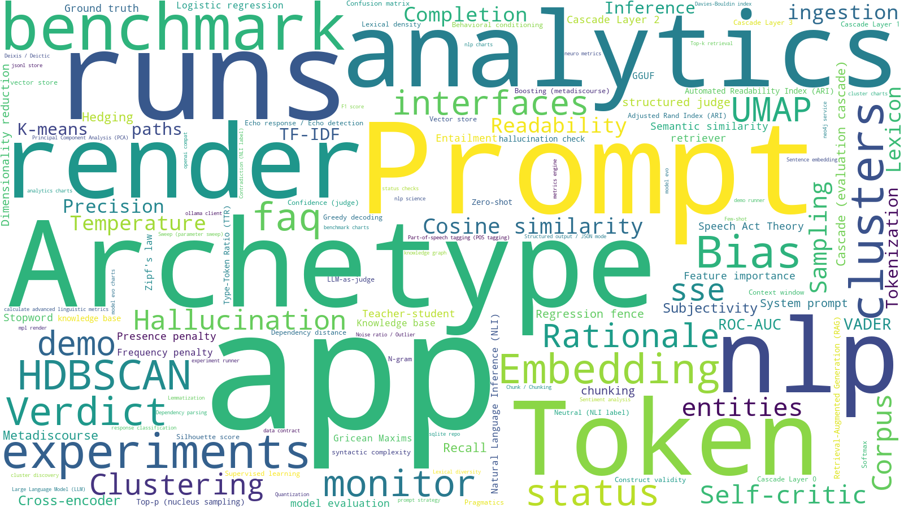

Architecture
============

High-level component diagram
-----------------------------

Two front ends (the web UI and the CLI batch runner) both drive one
``ExperimentRunner``/``MetricsEngine`` service layer, which only ever talks to
``core.domain`` interfaces -- never directly to Ollama, SQLite, or JSONL
files. The legacy Neo4j/knowledge-graph subsystem is drawn deliberately
disconnected: it stays on its own existing code path (now reached via the
small standalone ``run_knowledge_graph.py`` script, Stage 16) and is not part
of this layered rewrite.

As of Stage 16 this is no longer just a *target* -- every box below has a
real implementation behind it and is the primary way to run the app (see
:doc:`roadmap`).

.. uml::

   @startuml
   skinparam componentStyle rectangle
   skinparam backgroundColor transparent
   skinparam shadowing false

   package "Front ends" {
     [web/\nJinja2 + HTMX] as WEB
     [cli/\nconfig-driven batch runner] as CLI
   }

   package "api/  (FastAPI)" {
     [Routers\n(experiments, runs, analytics, nlp, clusters,\nmodel_evo, benchmark, monitor, faq)] as ROUTERS
     [SSE endpoint\n(EventSourceResponse)] as SSE
   }

   package "core.services/  (orchestration)" {
     [ExperimentRunner] as RUNNER
     [MetricsEngine] as METRICS
     [cluster_discovery] as CLUSTERSVC
   }

   package "core.domain/  (interfaces + entities, zero framework imports)" {
     interface LLMClient as ILLM
     interface Judge as IJUDGE
     interface PromptStrategy as IPROMPT
     interface Repository as IREPO
     interface KnowledgeBase as IKB
   }

   package "core.adapters/  (concrete implementations)" {
     [OllamaClient] as AOLLAMA
     [JSONLStore] as AJSONL
     [SQLiteRepo] as ASQLITE
     [RAG adapters\n(FAISS + SentenceTransformers)] as ARAG
     [StructuredJudge\n(2026-08-24 author-directed swap)] as AJUDGE
     [NaivePromptStrategy] as APROMPT
   }

   package "External systems" {
     database Ollama as OLLAMA
     database SQLite as SQLITE
     database "JSONL files" as JSONL
     database "knowledge/rag/*.txt" as KB
   }

   package "Untouched legacy  (not part of this rewrite)" #FFDDDD {
     [run_knowledge_graph.py] as KGSCRIPT
     database Neo4j as NEO4J
   }

   WEB --> ROUTERS
   WEB ..> SSE : SSE
   CLI --> RUNNER
   ROUTERS --> RUNNER
   ROUTERS --> METRICS
   ROUTERS --> CLUSTERSVC
   SSE ..> RUNNER : progress events
   RUNNER --> ILLM
   RUNNER --> IJUDGE
   RUNNER --> IPROMPT
   RUNNER --> IREPO
   RUNNER --> IKB
   METRICS --> IREPO
   CLUSTERSVC --> IREPO

   ILLM ..|> AOLLAMA
   IJUDGE ..|> AJUDGE
   IPROMPT ..|> APROMPT
   IREPO ..|> AJSONL
   IREPO ..|> ASQLITE
   IKB ..|> ARAG

   AOLLAMA --> OLLAMA
   AJSONL --> JSONL
   ASQLITE --> SQLITE
   ARAG --> KB

   KGSCRIPT ..> AJSONL : reads runs via
   KGSCRIPT --> NEO4J
   @enduml

Entity-relationship diagram
------------------------------

One run has many responses, on both storage backends -- generated directly
from the real schemas, not idealized. ``JSONLStore`` (the live backend) keeps
this as two files per run rather than a database; ``SQLiteRepo`` (built and
tested, not yet wired to any endpoint -- see :doc:`features`) keeps it as two
real tables with a foreign key. Both sides serialize the *same* logical
records: :class:`~core.domain.entities.RunRecord` (run-level metadata) and
one persisted-response dict per generation call (the full 66-key schema
documented in :doc:`features`).

.. uml::

   @startuml
   skinparam backgroundColor transparent
   skinparam shadowing false

   package "JSONLStore (live backend)" {
     entity "<run_id>.meta.json" as META {
       * run_id : str <<PK>>
       --
       started_at : str
       total_tasks : int
       config : ExperimentConfig (nested JSON)
     }
     entity "lab_export_<run_id>.jsonl" as JSONL_FILE {
       * one line per response
       --
       run_id : str <<FK>>
       .. 66 fields total, see Features page ..
       student, teacher, archetype, bias, output
       v_ok, v_ok_numeric, duration_ms
       prompt_tokens, completion_tokens, tokens_per_second
       rag_enabled, rag_query, rag_chunks_count
       .. + every PsychScientist/NeuroMetrics/linguistic-metric field
     }
   }

   package "SQLiteRepo (built, tested, not yet wired to an endpoint)" {
     entity "runs" as RUNS {
       * run_id : str <<PK>>
       --
       started_at : str
       total_tasks : int
       config_json : JSON
     }
     entity "responses" as RESPONSES {
       * id : int <<PK, autoincrement>>
       --
       run_id : str <<FK -> runs.run_id>>
       data_json : JSON
     }
   }

   META ||--o{ JSONL_FILE : "run_id"
   RUNS ||--o{ RESPONSES : "run_id"
   @enduml

Business-flow diagram
------------------------

The two evaluation stages CLAUDE.md SS3 requires stay separate: the
per-response cascade (write path, ``ExperimentRunner``) never does
corpus-level work, and the confirmatory-analysis stage (read path,
Stage 8-12's routers) only ever runs over an already-persisted corpus. These
two activity diagrams trace one real request through each path.

Write path -- per-response cascade (CLAUDE.md SS3a)
~~~~~~~~~~~~~~~~~~~~~~~~~~~~~~~~~~~~~~~~~~~~~~~~~~~~~~

.. uml::

   @startuml
   skinparam backgroundColor transparent
   skinparam shadowing false

   start
   :Config in\n(web form / CLI TOML) -> ExperimentConfig;
   :ExperimentRunner.try_start\n(validate, concurrent-run guard,\nmax_total_tasks cap);
   if (rejected?) then (yes)
     :400 / 413 / "already running";
     stop
   endif
   :RunRecord persisted (Repository.save_run);

   partition "Per-response cascade (CLAUDE.md SS3a) -- for each\nstudent x archetype x bias x swept-value" {
     :PromptStrategy.build\n(+ KnowledgeBase.retrieve if RAG-enabled);
     :LLMClient.generate (OllamaClient);
     :extract_best_text;
     :Layer 0 -- classify_response\n(VALID / EMPTY / MALFORMED_JSON /\nTRUNCATED / SCHEMA_ERROR);
     if (Layer 0: VALID?) then (no)
       :minimal entry\n(metrics, Layer 1/2, and judge all skipped);
     else (yes)
       :PsychScientist / NeuroMetrics /\ncalculate_advanced_linguistic_metrics\n(incl. Layer 1's semantic_overlap);
       :Layer 1 -- is_echo_response\n(semantic_overlap > 0.5)?;
       note right: Threshold is inverted from standard STS\nintuition -- rejects HIGH similarity to the\nbias label (echoed instruction), not low.\nCalibrated against real generated data,\nnot assumed. See wiki/04-llm-analytics.
       :Layer 2 -- check_hallucination\n(NLI cross-encoder vs. rag_context);
       note right: Runs regardless of the Layer 1 result above --\nonly meaningful (and only run) when RAG is\nenabled; logs a real contradiction score/label\nbut never gates v_ok (CLAUDE.md SS4, 2026-08-24).\nAn echo-rejected response can still show\nlayer2_checked=true.
       if (Layer 1: echo detected?) then (yes, echo)
         :synthesize rejection JudgeVerdict\n(real judge call skipped);
       else (no, genuine)
         :Judge.evaluate (StructuredJudge);
       endif
     endif
     :entry dict assembled (70+ fields, incl.\nlayer0_classification / layer1_echo_detected /\nlayer2_checked / layer2_predicted_label);
     :Repository.save_response;
     :progress event -> SSE queue / CLI stdout;
   }
   note right: Layer 2 is logging-only, not a gate -- no real-data\ncalibration for a rejection threshold exists yet\n(the same discipline that caught Layer 1's own\nthreshold needing to be inverted). Sentiment/toxicity\nclassifiers (CLAUDE.md SS3a's other Layer 2 half)\nremain entirely unbuilt.

   :Run complete -> "done" event;
   stop

   @enduml

Read path -- corpus-level confirmatory analysis (CLAUDE.md SS3b)
~~~~~~~~~~~~~~~~~~~~~~~~~~~~~~~~~~~~~~~~~~~~~~~~~~~~~~~~~~~~~~~~~~~

.. uml::

   @startuml
   skinparam backgroundColor transparent
   skinparam shadowing false

   start
   :GET /analytics, /nlp, /clusters,\n/model_evo, /benchmark, /monitor;
   :Repository.load_responses(run_id);
   if (no persisted responses?) then (yes)
     :404 "No responses found";
     stop
   endif
   :pandas.json_normalize\n(or LabDataBridge.build_dataframe for /nlp);

   partition "Corpus-level confirmatory analysis (CLAUDE.md SS3b) -- over\nthe WHOLE accumulated corpus, not one response" {
     :linguistic/NLP metric matrix\n(already computed per response, read back);
     :UMAP dimensionality reduction\n(/clusters -- Behavioral topology only);
     :HDBSCAN clustering;
     :Silhouette / Davies-Bouldin / ARI\n(compute_fit_indices);
     :Plotly / matplotlib rendering;
   }

   :200 -- rendered charts/tables;
   stop
   @enduml

Class-relations diagram
--------------------------

The domain layer's actual classes -- entities (pydantic models, plain data)
and interfaces (``Protocol``\ s, structurally satisfied, not inherited) --
and which concrete adapter satisfies each interface today.

.. uml::

   @startuml
   skinparam backgroundColor transparent
   skinparam shadowing false

   package "core.domain.entities (pydantic BaseModel)" {
     class ExperimentConfig {
       student_models: list[str]
       teacher_model: str | None
       self_critic: bool
       archetypes: list[str]
       biases: list[str]
       prompt_mode: PromptMode
       sweep_param/min/max/steps
       base_temperature/top_p/...
     }
     class RunRecord {
       run_id: str
       started_at: str
       config: ExperimentConfig
       total_tasks: int
     }
     class GenerationResult {
       text: str
       duration_ms: float
       model: str
       prompt_tokens/completion_tokens: int | None
       ollama_*_duration_ms: float | None
     }
     class JudgeVerdict {
       verdict: bool
       confidence: float | None
       rationale: str | None
     }
     enum PromptMode {
       TUNED
       BLIND
       RAW
     }
   }

   package "core.domain.interfaces (typing.Protocol)" {
     interface LLMClient {
       + generate(model, system_prompt, user_prompt, **params) : GenerationResult
     }
     interface Judge {
       + evaluate(response_text, archetype, bias, model) : JudgeVerdict
     }
     interface PromptStrategy {
       + build(archetype, bias, mode, **kwargs) : str
     }
     interface Repository {
       + save_run(run: RunRecord) : str
       + save_response(run_id, response: dict) : None
       + load_responses(run_id) : list[dict]
       + list_runs() : list[RunRecord]
     }
     interface KnowledgeBase {
       + retrieve(query, top_k) : list[dict]
     }
   }

   package "core.adapters (concrete, structurally satisfy the Protocols above)" {
     class OllamaClient
     class StructuredJudge
     class NaivePromptStrategy
     class JSONLStore
     class SQLiteRepo
     class RAGKnowledgeBase
   }

   RunRecord *-- ExperimentConfig : contains
   LLMClient <.. OllamaClient
   Judge <.. StructuredJudge
   PromptStrategy <.. NaivePromptStrategy
   Repository <.. JSONLStore
   Repository <.. SQLiteRepo
   KnowledgeBase <.. RAGKnowledgeBase

   OllamaClient ..> GenerationResult : returns
   StructuredJudge ..> JudgeVerdict : returns
   JSONLStore ..> RunRecord : persists/returns
   SQLiteRepo ..> RunRecord : persists/returns
   @enduml

Layering rule
-------------

``web`` / ``api`` depend on ``core.services``, which depends only on
``core.domain``. ``core.adapters`` implements ``core.domain`` interfaces;
``core.domain`` never imports from ``core.adapters``, ``api``, or ``web``.

Feature map (user journey)
------------------------------

Added 2026-08-24 at the author's request for a more navigable, "what can I actually do here"
overview, complementing the component/class/ER diagrams above (which answer "how is it built," not
"what does it do"). Every branch below is a real, reachable page or a real sub-capability of one --
traced directly against ``web/templates/_nav.html`` and each router, not invented for the
diagram. Colors group the same three CLAUDE.md SS3a/SS3b-derived categories the sidebar itself uses
(``[req]``/``[corpus]``/``[sys]``), plus a fourth for the per-response cascade specifically, since
it's a cross-cutting concept, not one page. Updated 2026-09-05 with a fifth branch for the separate
Neo4j knowledge-graph entry point (``run_knowledge_graph.py``, its own standalone Streamlit process,
not reachable from ``_nav.html`` at all) -- omitted until now, which meant this "what can I do here"
map was silently incomplete for anyone who didn't already know that page existed.

.. uml::

   @startmindmap
   * nn_lab
   left side
   **[#2c5f8a] Generation /experiments
   ***[#2c5f8a] Archetype x Bias conditioning
   ***[#2c5f8a] Prompt mode: Tuned / Blind / Raw
   ***[#2c5f8a] Parameter sweep
   ****[#2c5f8a] Temperature / Top-P
   ****[#2c5f8a] Frequency / Presence penalty
   ***[#2c5f8a] RAG toggle
   ****[#2c5f8a] Archetype+Bias / Archetype-only / Global
   ***[#2c5f8a] Self-critic vs. teacher-student
   ***[#2c5f8a] Live SSE progress + Stop button
   **[#8a4a2c] Per-response cascade
   ***[#8a4a2c] Layer 0 -- validity gate
   ***[#8a4a2c] Layer 1 -- echo detector
   ***[#8a4a2c] Layer 2 -- NLI vs. RAG context (logging-only)
   ***[#8a4a2c] Layer 3 -- StructuredJudge
   **[#2c5f8a] Performance /runs
   ***[#2c5f8a] Run summaries
   **[#2c5f8a] Model Evaluation /model_evo
   ***[#2c5f8a] Logistic-regression baseline
   ***[#2c5f8a] Feature importance
   right side
   **[#3a7d5c] Analytics /analytics
   ***[#3a7d5c] Adherence & metrics
   ***[#3a7d5c] High-Dim analytics
   ***[#3a7d5c] Zipf deviation
   **[#3a7d5c] NLP Science /nlp
   ***[#3a7d5c] NLP-1: morphology / cognition
   ***[#3a7d5c] NLP-2: emotional stability
   ***[#3a7d5c] NLP-3: self-focus / rigidity
   **[#3a7d5c] Clustering /clusters
   ***[#3a7d5c] KMeans + PCA
   ***[#3a7d5c] HDBSCAN (density)
   ***[#3a7d5c] Behavioral topology (UMAP)
   **[#3a7d5c] Benchmark /benchmark
   ***[#3a7d5c] Weighted leaderboard
   **[#6b6b6b] System Monitor /monitor
   ***[#6b6b6b] Schema / dtype inspector
   **[#6b6b6b] Service status
   ***[#6b6b6b] Ollama / NLTK / spaCy
   **[#6b6b6b] FAQ /faq
   right side
   **[#b5651d] Knowledge Graph (Neo4j, separate script)
   ***[#b5651d] streamlit run run_knowledge_graph.py
   ***[#b5651d] Sync history to Neo4j\n(Archetype<->Bias co-occurrence)
   ***[#b5651d] PageRank-1..4 (GDS)
   ***[#b5651d] Root Cause (Failure-Mode Graph)
   ****[#b5651d] Sync failure-mode graph\n(cascade lineage, RAG provenance)
   ****[#b5651d] Echo-rejections by model
   ****[#b5651d] Terminal cascade stage by archetype
   ****[#b5651d] RAG chunk categories vs. echo
   ***[#b5651d] Hypothesis Testing / Uncertainty Analysis\n(pandas/scipy, no graph queries)
   @endmindmap

Tag cloud
------------

Generated by ``utils/generate_tag_cloud.py`` (run manually, output committed -- matches
``utils/list_tests.py``'s existing convention, not a Sphinx build-time step) from two real, cited
sources: every term name in :doc:`glossary`, and every real Python module under ``core``/``api``/
``web``. Word size is real occurrence frequency across ``docs/source/**/*.rst``, not an assumed
importance ranking -- a concept the docs actually discuss often renders larger than one mentioned in
passing, the same "measure it, don't assume it" discipline the rest of this project's docs follow.

Corpus-level analysis pipeline (clustering)
------------------------------------------------

The full path from a run's raw JSONL responses to the "Behavioral topology" view's rendered charts
(:func:`core.services.cluster_discovery.run_behavioral_topology`) -- the single heaviest computation
in the corpus-level confirmatory-analysis stage (CLAUDE.md SS3b).

.. uml::

   @startuml
   skinparam backgroundColor transparent
   skinparam shadowing false
   skinparam activity {
     BackgroundColor #f5f0ff
     BorderColor #6b4fa0
   }
   skinparam activityDiamond {
     BackgroundColor #eee6ff
     BorderColor #6b4fa0
   }

   start
   :Raw JSONL responses\n(Repository.load_responses);
   :Filter -- v_ok, min_words,\nJSON-echo removal, min_coherence;
   if (enough rows survive?\n(< min_cluster_size/vis_neighbors/\ncluster_neighbors + 1)) then (no)
     :empty BehavioralTopologyResult\n("not enough data" in the UI);
     stop
   endif
   :Select feature-group columns\n(Behavioral / Linguistic / Runtime / Validation);
   :StandardScaler.fit_transform;

   fork
     :UMAP -- 2D projection\n(x_vis, y_vis, for the scatter plot);
   fork again
     :UMAP -- 10-30D projection\n(a *separate* embedding, only for clustering --\nforcing both roles onto one 2D space distorts density);
   end fork

   :HDBSCAN.fit_predict\n(on the higher-D embedding);
   :cluster_id / cluster_name\nassigned (-1 = "Noise");

   fork
     :Outliers table\n(cluster_id == -1 rows);
   fork again
     :compute_fit_indices\n(Silhouette, Davies-Bouldin, ARI vs. archetype);
   fork again
     :MST / condensed-tree plots;
     note right: Both wrapped in try/except -- HDBSCAN's own\nplotting code can throw on small/degenerate inputs;\nfalls back to "unavailable" rather than a 500.
   end fork

   :Plotly (scatter, membership) +\nmatplotlib (condensed tree) rendering;
   :200 -- 7 Behavioral Topology sub-views;
   stop
   @enduml

Neo4j knowledge-graph flow (legacy, CLAUDE.md SS1 -- two narrow, explicit, dated exceptions)
-------------------------------------------------------------------------------------------------

Not part of the layered rewrite, and CLAUDE.md SS1's quarantine (no refactor, no re-layering behind
a ``core.domain`` interface, no promotion into this project's testing/architecture discipline)
stands unchanged. But this subsystem is **not entirely untouched** as of 2026-09-05 -- two narrow,
explicit, author-requested exceptions landed, same precedent as the earlier judge-fix exception
(CLAUDE.md SS4/SS6): (1) a real, disclosed GDS configuration bug (not a code bug -- ``neo4j.conf``
never unrestricted/allowlisted ``gds.*``, even though the plugin was installed) was found and fixed,
verified live; and (2) a second, additive sync + 3 root-cause queries were added, modeling the
actual per-response cascade as an explicit lineage graph. Full record, real captured proof
(screenshots, real query output), and the exact scope of what changed vs. what stayed untouched:
:doc:`wiki/07-knowledge-graph-results`.

Original sync + PageRank flow (scripts 1-3 untouched; script 4 got a real bug fix)
~~~~~~~~~~~~~~~~~~~~~~~~~~~~~~~~~~~~~~~~~~~~~~~~~~~~~~~~~~~~~~~~~~~~~~~~~~~~~~~~~~~~~~

.. uml::

   @startuml
   skinparam backgroundColor transparent
   skinparam shadowing false
   skinparam activity {
     BackgroundColor #fdf0e8
     BorderColor #b5651d
   }

   start
   :run_knowledge_graph.py\n(standalone Streamlit entry point);
   :JSONLStore.load_responses(run_id)\n(same Repository the FastAPI app/CLI write to);
   :pandas DataFrame (+ run_id column,\nadded 2026-09-05 -- needed by the\nfailure-mode graph below);
   :KnowledgeGraph.knowledge_graph_tab(df);

   partition "Neo4jService (py2neo)" {
     :load_neo4j_creds\n(config/config.ini [neo4j]);
     :Graph(uri, auth=(user, password));
   }

   if ("Sync history to Neo4j" clicked?) then (yes)
     :UNWIND $rows AS row\nMERGE (a:Archetype) MERGE (b:Bias)\nMERGE (a)-[:ASSOCIATED_WITH]->(b);
   endif

   partition "PageRank scripts 1-4 (GDS)" {
     :CALL gds.graph.project\n(archetypeGraph / experimentGraph);
     :CALL gds.pageRank.stream;
     note right: Fixed 2026-09-05, verified live: the plugin was\ninstalled but neo4j.conf never unrestricted/\nallowlisted gds.* -- a config gap, not a missing\ndependency. Script-4 also had a real code bug\n(no exists-check/projection guard, unlike 1/3) --\nfixed to match their pattern. See wiki/07 for the\nreal PageRank output captured after the fix.
   }

   :Streamlit bar chart / table\n(rendered in-process, not via the FastAPI app);
   stop
   @enduml

Failure-mode / cascade-lineage graph (new, additive, 2026-09-05)
~~~~~~~~~~~~~~~~~~~~~~~~~~~~~~~~~~~~~~~~~~~~~~~~~~~~~~~~~~~~~~~~~~~

A second sync, a new "Root Cause (Failure-Mode Graph)" tab -- does not touch or replace the
Archetype/Bias/PageRank graph above. Models the actual per-response cascade (the same write-path
activity diagram earlier on this page) as explicit lineage edges, so a failure becomes a graph
traversal instead of a correlation you already have to suspect. Schema and real, captured query
results (a real 500-response run: 27 vs. 12 echo-rejections by model; one RAG knowledge category
linked to 36 of the run's echo failures): :doc:`wiki/07-knowledge-graph-results`.

.. uml::

   @startuml
   skinparam backgroundColor transparent
   skinparam shadowing false

   entity "Response" as RESP {
     * response_id : str <<PK, = run_id + ":" + step>>
     --
     word_count, duration_ms
   }
   entity "Run" as RUN {
     * run_id : str <<PK>>
   }
   entity "Archetype" as ARCH {
     * name : str <<PK>>
   }
   entity "Bias" as BIAS {
     * name : str <<PK>>
   }
   entity "Model" as MODEL {
     * name : str <<PK>>
   }
   entity "CascadeOutcome" as OUTCOME {
     * stage : str
     * result : str
     --
     .. small, fixed dictionary -- reused by
     .. every response that reaches it, not
     .. one node per response
   }
   entity "CascadeStage" as STAGE {
     * name : str <<PK, one of Layer0/1/2/Judge>>
   }
   entity "KnowledgeChunk" as CHUNK {
     * archetype : str
     * category : str
     --
     .. RAG provenance, recovered by parsing
     .. the persisted rag_context string
   }

   RESP }o--|| RUN : IN_RUN
   RESP }o--|| ARCH : CONDITIONED_ON
   RESP }o--|| BIAS : CONDITIONED_ON
   RESP }o--|| MODEL : GENERATED_BY
   RESP }o--o{ MODEL : "JUDGED_BY (same node as\nGENERATED_BY in self-critic mode)"
   RESP }o--o{ OUTCOME : "REACHED {score, confidence}\n(one edge per stage reached --\na Layer-0-rejected response has exactly one)"
   RESP }o--o{ CHUNK : "RETRIEVED\n(only when RAG enabled)"
   OUTCOME }o--|| STAGE : PART_OF
   STAGE ||--o{ STAGE : "PRECEDES (fixed pipeline\norder, used by the terminal-stage\nroot-cause query)"
   @enduml
